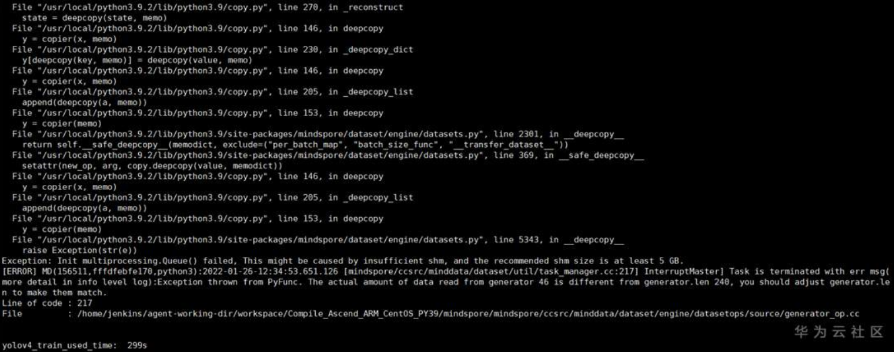

# 数据集加载多进程(multiprocessing)错误

1. This might be caused by insufficient shm, and the recommended shm size is at least 5 GB.、

系统可用的共享内存太小，可以通过 df -h 查看共享内存的大小，如下示例有500G的共享内存，妥妥的够用啦。
解决办法：

2. 解决办法
如果发现自身系统的 /dev/shm 不足5G，那确实会导致这个错误，有2个解决办法

关闭多进程模式，即设置python_multiprocessing=False。这样就会采用多线程模式进行加速，同样也会有一定的加速效果，也可以调节num_parallel_workers增加线程/进程数，以提高整体的数据处理效率。

申请更多的共享内存，可以参考博客上教程调整共享内存，如 https://blog.csdn.net/Sunny_Future/article/details/100569637
