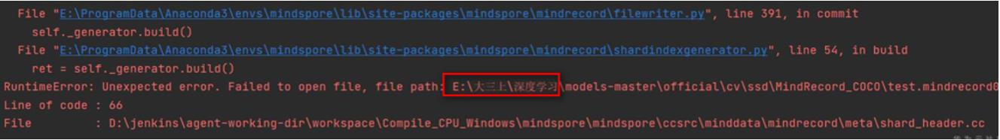

# MindRecord-Windows下中文路径问题Unexpected error. Failed to open file

1. MindRecord是MindSpore开发的一种高效数据格式。

此模块提供了一些方法帮助用户将不同数据集转换为MindRecord格式， 也提供了一些操作MindRecord数据文件的方法如读取、写入、检索等。 用户可以使用FileWriter API生成MindRecord格式数据集，并使用MindDataset API加载MindRecord格式数据集。

相关的API可以参考：mindspore.mindrecord

然而，在Windows平台上，且MindSpore版本 <= 1.5.0情况下，在MindRecord接口使用中文路径时，会出现如下错误：
RuntimeError: Unexpected error. Failed to open file, file path E:\大三上\深度学习\models-master\official\cv\ssd\MindRecord_COCO\test.mindrecord
File: mindspore\ccsrc\minddata\minrecord\meta\shard_header.cc

写入MindRecord的脚本：

2. 运行错误：

RuntimeError: Unexpected error. Failed to open file, file path E:\大三上\深度学习\models-master\official\cv\ssd\MindRecord_COCO\test.mindrecord
File: mindspore\ccsrc\minddata\minrecord\meta\shard_header.cc

RuntimeError: Unexpected error. Failed to open file, file path E:\大三上\深度学习\models-master\official\cv\ssd\MindRecord_COCO\test.mindrecord
File: mindspore\ccsrc\minddata\minrecord\meta\shard_header.cc

3. 原因：

在MindSpore1.5.0以及之前版本，不支持Windows环境下MindSpore数据集格式在中文路径下的写入和读取。

4. 解决办法：

将MindRecord格式数据集的输出路径指定在纯英文路径下。

MindSpore升级到1.6.0之后版本。
